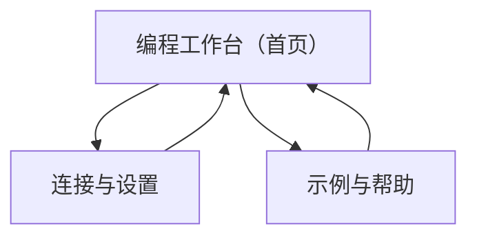

## 1. Product Overview
面向教育/创客场景的“机器人拖拽积木编程”网页，让你像 Scratch 一样拖拽积木拼出程序并一键控制机器人。
产品仅通过机器人既有接口 `POST /control` 下发控制指令，不新增/不更改机器人端接口。

## 2. Core Features

### 2.1 Feature Module
本产品由以下核心页面构成：
1. **编程工作台（首页）**：积木库与工作区、运行/停止、程序与连接状态、日志与错误提示。
2. **连接与设置**：机器人地址/端口配置、连接测试、超时与重试策略、运行参数（如速度档位等以“既有协议支持项”为准）。
3. **示例与帮助**：内置示例程序、积木说明与快捷键、常见问题（网络/权限/浏览器兼容）。

### 2.2 Page Details
| Page Name | Module Name | Feature description |
|-----------|-------------|---------------------|
| 编程工作台（首页） | 顶部导航与状态区 | 显示当前机器人连接状态、当前项目名称；入口跳转到“连接与设置/示例与帮助”。 |
| 编程工作台（首页） | 积木库（分类） | 按类别展示可用积木；支持搜索/快速定位（仅前端过滤）。 |
| 编程工作台（首页） | 工作区（拖拽编排） | 拖拽积木到工作区并自动吸附拼接；支持撤销/重做、缩放、对齐到网格。 |
| 编程工作台（首页） | 程序运行控制 | 点击“运行/停止/单步（可选）”；运行前做基本校验（如缺少起始积木/参数为空）。 |
| 编程工作台（首页） | 指令下发（仅 /control） | 将积木程序转换为机器人既有协议的请求体，并通过 `POST /control` 下发；处理超时/失败并提示。 |
| 编程工作台（首页） | 反馈与日志 | 展示最近请求结果（成功/失败/耗时）；显示错误原因与建议（如地址不可达、跨域、超时）。 |
| 连接与设置 | 机器人连接配置 | 配置机器人访问基址（例如 IP/域名、端口、http/https）；本地保存（浏览器存储）。 |
| 连接与设置 | 连接测试 | 发起一次 `POST /control` 的“测试请求”（按既有协议的安全/空操作方式）；显示结果与延迟。 |
| 连接与设置 | 通信策略 | 配置请求超时、失败重试次数；在运行时生效。 |
| 示例与帮助 | 示例程序 | 浏览并一键载入示例到工作区（覆盖前提示）。 |
| 示例与帮助 | 积木说明与快捷键 | 解释每类积木的用途与参数含义（以你提供的协议/积木定义为准）；列出常用快捷键（撤销/缩放/运行）。 |
| 示例与帮助 | 常见问题 | 指导你排查“无法连接/跨域/浏览器限制/机器人无响应”等问题。 |

## 3. Core Process
**你的主要使用流程**：
1) 进入“编程工作台”，如未配置连接则跳转/提示到“连接与设置”。
2) 在“连接与设置”中填写机器人地址并点击“连接测试”，确认可达。
3) 回到“编程工作台”，从积木库拖拽积木到工作区拼出程序。
4) 点击“运行”，系统将积木编排转换为机器人既有控制协议，并通过 `POST /control` 下发。
5) 运行中/结束后，在日志区查看请求结果；失败则按提示调整连接或程序。

