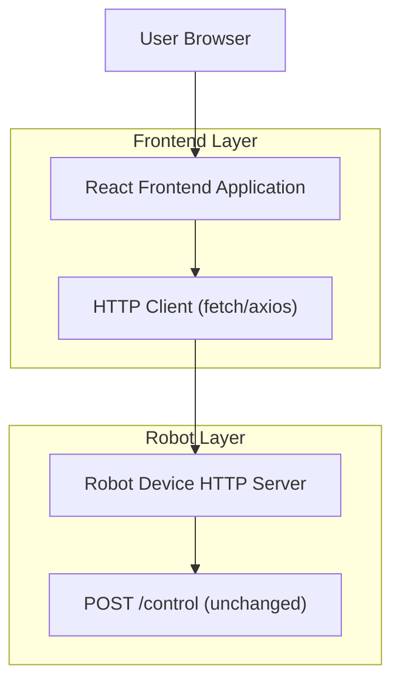

## 1.Architecture design

## 2.Technology Description
- Frontend: React@18 + TypeScript + vite
- UI/Style: tailwindcss@3（或 CSS Modules）+ 自定义 Scratch 卡通主题（圆角、描边、投影、亮色面板）
- Drag & Drop Blocks: blockly（自定义主题与积木定义，工作区吸附/拼接/缩放）
- Backend: None（前端直接请求机器人 `POST /control`）

## 3.Route definitions
| Route | Purpose |
|-------|---------|
| / | 编程工作台：首页，积木编排与运行控制、状态与日志展示 |
| /connect | 连接与设置：机器人地址配置、连接测试、超时/重试配置 |
| /help | 示例与帮助：示例载入、积木说明、常见问题 |

> 备注：若你的部署环境存在浏览器到机器人设备的跨域限制（CORS），可在同域提供反向代理把 `/control` 透传到机器人；但机器人端接口仍保持仅 `POST /control` 不变。
